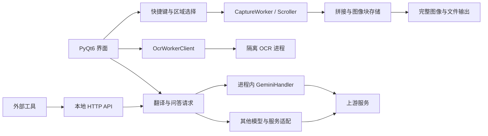

# 界面与运行时架构

本文是当前模块分工的入口，说明 UI、截图、OCR、数据和模型请求之间的边界。带目录的路径均相对于仓库根目录；表中的简写文件名相对于对应模块目录。

## 公开入口与 UI 聚合类

`MainWindow`、`SettingsDialog` 和 `OcrTextPanel` 保持公开入口及 Qt 对象身份，具体职责拆入 Mixin 或独立逻辑模块。新增职责应优先进入对应模块，避免继续扩大聚合文件。

Mixin 不另行建立一套对象初始化流程，共享状态由聚合类协调。纯文本、配置和查询逻辑尽量与 Qt 控件分离。

| 聚合入口 | 主要职责模块 |
| --- | --- |
| `deepcat/ui/main_window/window.py` | `window_shell.py` 管理启动与生命周期；`window_navigation.py` 管理导航和尺寸；`window_embedded_settings.py` 管理内嵌设置；`window_runtime_state.py` 管理状态与通知。 |
| `deepcat/ui/main_window/` | `capture.py`、`translator.py`、`notes.py`、`later_read.py`、`resource_shortcuts.py` 等分别处理业务页面和动作。 |
| `deepcat/ui/settings_dialog/dialog.py` | `translator_settings.py`、`presentation.py`、`general_settings.py`、`model_config_logic.py` 等管理设置显示、应用及模型配置。 |
| `deepcat/ui/post_capture_actions/text_panel.py` | 上下文、附件、执行、历史和窗口行为分别位于 `text_panel_context.py`、`text_panel_attachments.py`、`text_panel_execution.py`、`text_panel_history.py`、`text_panel_window.py`。 |

`window_search.py` 协调搜索界面；`search_logic.py` 和 `context_logic.py` 等模块承担不依赖具体控件的判断与数据处理。

## 核心数据流

## 输入与截图

- `deepcat/input/windows_hotkey.py` 通过 Windows 系统注册接收普通全局热键。
- `deepcat/input/hotkey_listener.py` 管理注册与回调分发，也保留捕获期间使用的事件监听逻辑。
- `selection_translate.py` 处理划词、选区取词与相应的输入抑制；不能把所有输入路径概括为同一种热键机制。
- `region_overlay.py` 与 `capture_worker.py` 协调区域选择和后台捕获。

窗口截图、逻辑像素、物理像素和多屏坐标不能混用。回调进入 Qt 控件时应遵守主线程边界。

## 长图与输出

`deepcat/core/image_piece_store.py` 在内存预算内保存图像块，必要时写入临时存储。`deepcat/output/png_stream.py` 逐块编码完整 PNG，`deepcat/output/scroll_saver.py` 协调完整图像输出和 JPEG 超限回退。

`deepcat/ui/scroll_result.py` 与图像保存工作线程在后台准备完整输出。分块是处理策略，不表示最终结果必须是多个分段文件，也不意味着任意大小的图像都能在有限内存中显示或编辑。

## OCR

`ocr_worker_client.py` 管理隔离进程、请求、取消、复用与回收；`ocr_ipc.py` 定义通信帧；`ocr_worker.py` 负责实际推理。RapidOCR 和 PP-OCRv6 根据引擎选择加载，切换时替换相应进程。

模型解析与固定文件校验由 `ppocrv6_runtime.py` 负责。模型分发错误应尽早报告，不应在用户首次识别时悄悄下载缺失模型。

## 记录、搜索与恢复

复制记录存于 SQLite。`clipboard_database.py` 提供首屏只读快照、记录操作和统计；`query_worker.py` 合并和执行后台查询；`search_index.py` 维护全文及子串检索。

页面显示可以先使用首屏数据，但查询完成、筛选变化、功能关闭和恢复操作仍需正确处理。不能用“已有缓存”代替数据变更后的刷新。

表格笔记、稍后阅读、待办、对话和提示词使用对应的数据存储模块。`deepcat/core/data_manager.py` 与 `restore_transaction.py` 协调备份、恢复、校验及失败回滚。

## 模型通道与网络边界

- `translator_engine.py` 和界面 worker 负责请求编排；`deepcat/utils/http_client_pool.py` 提供有界客户端复用。
- `local_gemini_web2api_server.py` 与 `inproc_http.py` 将应用内 Gemini 请求交给同一进程内的处理器，保留请求、响应和流式语义，不监听 `8081`。
- `gemini_web2api.py` 仍提供可独立运行的 HTTP 服务入口；这是另一种运行方式。
- `translation_server.py` 是供外部工具连接的本地 API 网关，包含鉴权、接口路由、流式输出、IPv6 回环和可达性探测。
- ChatGPT Web、HY-MT 和上游在线模型有各自的服务与连接生命周期，不能因 Gemini 使用进程内通道就推断其他通信也不经过网络。

请求取消、客户端关闭和上游实际结束不是同一件事。实现时需要保留资源所有权和回收路径，避免误关闭其他请求使用的客户端。

## 兼容与维护

`module_compat.py` 用于兼容既有聚合模块的导入和测试替换路径。新增依赖优先通过明确参数或独立服务传入，避免扩大动态代理范围。

用户可见行为同步到 [使用指南](../../USER_GUIDE.md)，接口变化同步到 [本地 API 文档](../../LOCAL_API_SERVICE.md)，线程与构建相关改动按 [BUILDING.md](../../BUILDING.md) 验证。
